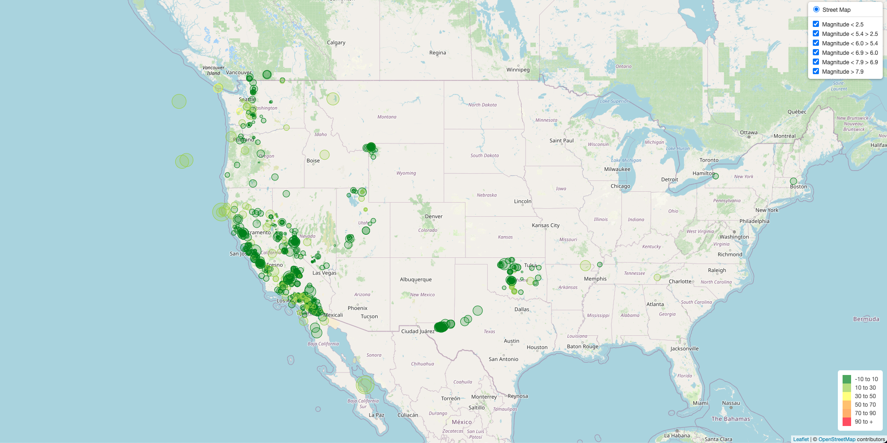

# Visualizing Data with Leaflet

## Background

The United States Geological Survey, or USGS for short, is responsible for providing scientific data about natural hazards, the health of our ecosystems and environment, and the impacts of climate and land-use change. Their scientists develop new methods and tools to supply timely, relevant, and useful information about the Earth and its processes. As a new hire, you will be helping them out with an exciting new project!

The USGS is interested in building a new set of tools that will allow them to visualize their earthquake data. They collect a massive amount of data from all over the world each day, but they lack a meaningful way of displaying it. Their hope is that being able to visualize their data will allow them to better educate the public and other government organizations (and hopefully secure more funding) on issues facing our planet.

## What we accomplished:

### Created the Earthquake Visualization

1. Got the dataset by doing the folowing:

   - Use d3 library to get some live data from (http://earthquake.usgs.gov/earthquakes/feed/v1.0/geojson.php) page and choose a dataset for one week to visualize.
jkk
2. Imported and visualize the data by doing the following:

   - Using Leaflet, to create a map that plots all the earthquakes from the dataset based on the longitude and latitude.

     - Reflect the magnitude of the earthquacks by the size and the depth by color.
     - After googling the magnitude range of the earthquacks, we created 6 magnitude layers:
       - mag1: less than or equal to 2.5
       - mag2: greater than 2.5 and less than or equal to 5.4
       - mag3: greater than 5.4 and less than or equal to 6
       - mag4: greater than 6 and less than or equal to 6.9
       - mag5: greater than 6.9 and less than or equal to 7.9
       - mag6: greater than 7.9

   - Included popups to provide additional information about the earthquake.

   - Created a legend that provide context for the map data.
